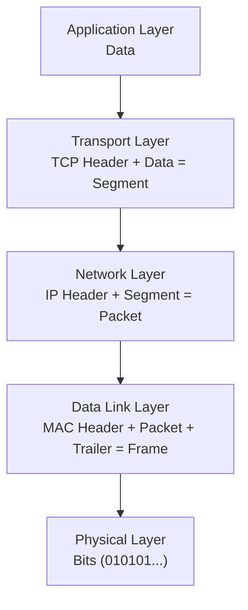
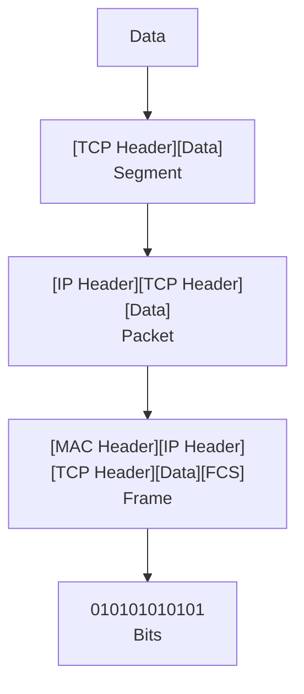
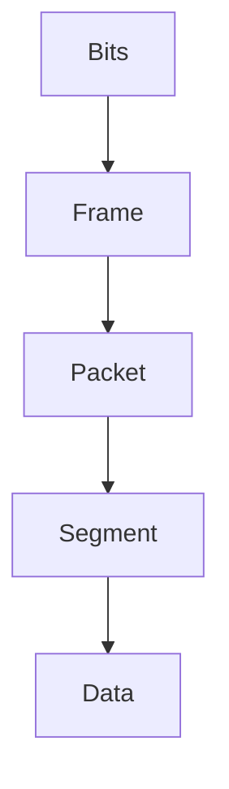
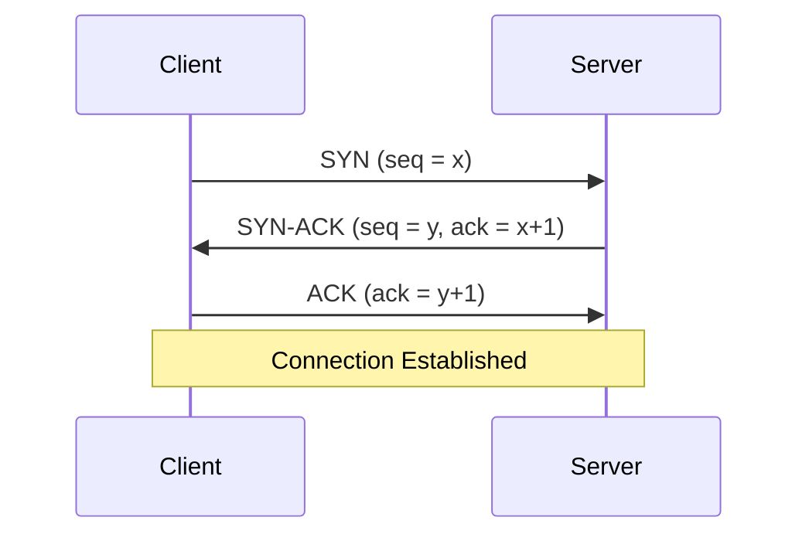

# Encapsulation in Networking

Encapsulation is the process of wrapping data with protocol-specific information (headers/trailers) as it moves down the network stack.

Each layer adds its own metadata.

## Simple Flow

- Application -> Data
- Transport -> Segment
- Network -> Packet
- Data Link -> Frame
- Physical -> Bits

### Visualization with real Headers

### Decapsulation (Receving side)

## Real Example (HTTP Request)

GET /users HTTP/1.1

It becomes:

1. Application -> HTTP request
2. Transport -> TCP segment (adds port info)
3. Network -> IP packet (adds IP addresses)
4. Data Link -> Frame (adds Mac addresses)
5. Physical -> Sent as bits

## TCP 3-Way Handshake

