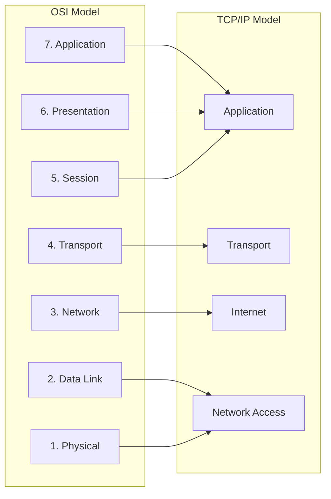
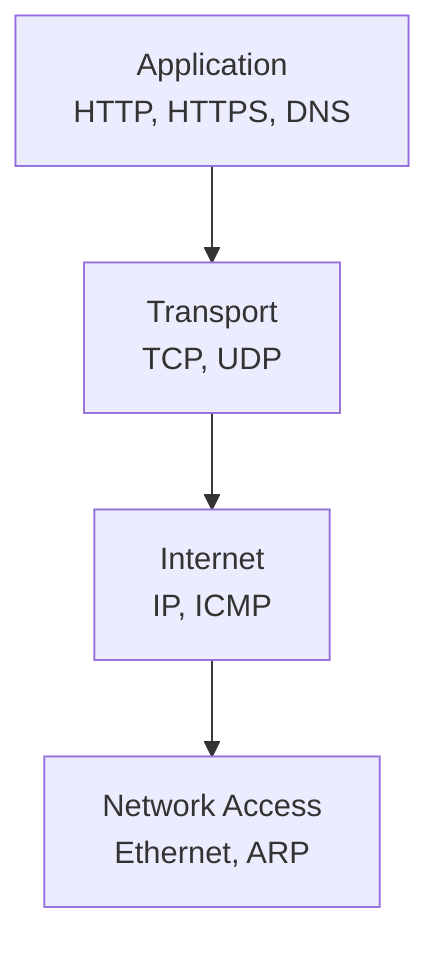

# OSI model vs TCP/IP

OSI = conceptual model (teaching tool)
TCP/IP = practical model (used in real systems, the Internet)

## Side by Side Comparison

| OSI Model (7 Layers) | TCP/IP Model (4 Layers) | Notes     |
| -------------------- | ----------------------- | --------- |
| Application          | Application             | Merged    |
| Presentation         | Application             | Merged    |
| Session              | Application             | Merged    |
| Transport            | Transport               | Same      |
| Network              | Internet                | Same idea |
| Data Link            | Network Access          | Merged    |
| Physical             | Network Access          | Merged    |

## Real Protocol Mapping

## Key Differences (Short but Sharp)
1. Number of Layers
- OSI → 7 layers
- TCP/IP → 4 layers
2. Purpose
- OSI → theoretical, standardized model
- TCP/IP → real-world implementation
3. Design Philosophy
- OSI → strict separation of concerns
- TCP/IP → practical and flexible
