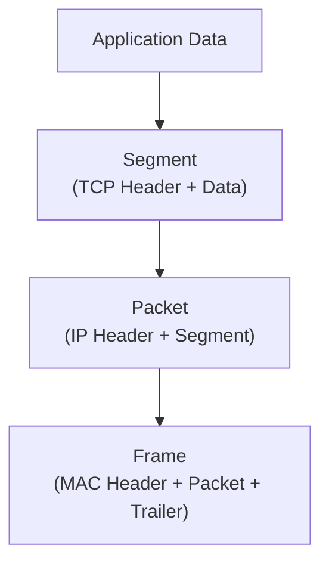

# Packet vs Segment vs Frame

These are the same data at different layers, just wrapped differently:

- Segment -> Transport layer (TCP/UDP)
- Packet -> Network Layer (IP)
- Frame -> Data Link Layer (Ethernet)

## Layer Mapping 

| Unit    | Layer     | Protocol Example |
| ------- | --------- | ---------------- |
| Segment | Transport | TCP / UDP        |
| Packet  | Network   | IP               |
| Frame   | Data Link | Ethernet         |
